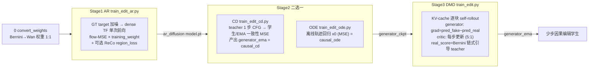

# Bernini 蒸馏三阶段审查

> 生成日期：2026-07-05
> 目标：把 Bernini-R 1.3B 编辑模型按 **Causal-Forcing 的训练/推理方式**蒸馏成实时流式编辑学生。
> 本文核实两件事：(1) 三阶段训练流程是否与 Causal-Forcing 原始方法一致；(2) 骨架架构是否与 Bernini 一致。
> 方法：基于**当前源码**逐文件重读对比（非凭记忆），覆盖脚本 / config / 训练入口 / 模型 / pipeline。
> 配套历史记录：`CAUSAL_FORCING_ALIGNMENT_REVIEW.md`、`Bernini-CausVid-代码审阅结论.md`、
> `Bernini-CausVid-代码核实与修复.md`、`Stage1_RoPE与流式推理对齐说明_20260629.md`。

---

## 0. 结论速览

- **架构（vs Bernini）**：`CausalEditWanModel` 是 Bernini-R 1.3B DiT 的"改名重实现"。
  `tools/convert_bernini_to_wan.py` 把 Bernini 权重 **1:1** 映射到 vendored-Wan 参数布局，
  DiT 超参、3D-RoPE、`source_id`/`visual_id_freqs` 公式、condition token 打包、
  **dense 前向的 timestep 共享**全部逐位一致。差异只有两类：
  (a) 有意的因果 / 流式改造（attention mask、teacher-forcing 序列、KV-cache）；
  (b) 几处需拍板的保真点（见 §4）。
- **方法（vs Causal-Forcing）**：三阶段四种方法的**核心 loss 与前向流程逐行对齐**。
  只有 **DMD** 用 self-rollout + KV-cache；**AR / CD / ODE 都是 dense teacher-forcing 单次前向**，
  因果性靠 attention mask —— 与原始 Causal-Forcing 设计完全一致。
  编辑相关差异均为必要新增（source/ref 条件、双 KV-cache、Bernini 链式引导 teacher、
  ReCo region loss 可选项）。

**总判定：在当前配置（21 latent 帧定长、帧对齐、`num_frame_per_block=3`、4 步去噪）下，
三阶段蒸馏在方法上与 Causal-Forcing 对齐、在架构上与 Bernini 权重级一致。§4 列出的是
"是否严格＝离线 Bernini 分布"的保真选择项，非"跑不起来"的缺陷。**

---

## 1. 架构一致性（对照 Bernini）

### 1.1 权重转换（1:1）

- 脚本 `scripts/0_convert_weights.sh` → `tools/convert_bernini_to_wan.py`。
- `BLOCK_MAP` / `TOP_MAP` 把 diffusers 键名映射到 Wan 键名，例如：
  `attn1.to_q.weight → self_attn.q.weight`、`norm2.weight → norm3.weight`（cross-attn norm 交换）、
  `ffn.net.0.proj.weight → ffn.0.weight`、`scale_shift_table → modulation`、
  `proj_out.weight → head.head.weight`。
- 转换后对照 `WanModel.state_dict()` 断言 **name + shape 完全匹配**，否则失败。
- `CausalEditWanModel.from_causal_model` 只做**类提升**（in-place `__class__` 替换），
  不引入任何新的可学习参数；`visual_id_freqs` / `rope.freqs` 为运行时重算的 buffer，不在 ckpt 中。

### 1.2 逐位一致的部分

| 组件 | Bernini | causal_edit_model | 判定 |
|---|---|---|---|
| DiT 超参 | dim 1536 / 30 层 / 12 头 / head_dim 128 / ffn 8960 / patch (1,2,2) / in-out 16 | 同 | ✅ |
| block 拓扑 | self-attn→cross-attn→FFN，6 路 + head 2 路 AdaLN | 同（`modulation`↔`scale_shift_table`） | ✅ |
| 3D-RoPE 表 | t/h/w 切 `[22,21,21]` complex，θ=10000 | `rope_params(1024,…)` 同切分同 θ | ✅ |
| `source_id` 增量 | `get_1d_rotary_pos_embed(head_dim,1024,10000)` 按 id 取一行常数旋转 | 同公式 | ✅ |
| condition 打包 | source→sid=1,2…；ref 递增；target=0 | 同（`edit_wrapper.py`） | ✅ |
| dense timestep 共享 | 所有 visual token（含 source/ref）用当前去噪 t | `forward_edit` `cond_timestep=None`→当前 t | ✅ |

> `source_id=0` 时 Bernini 乘 `visual_id_freqs[0]`（＝单位元），本实现用 `vid=None` 跳过乘法，
> 数值等价。dense↔流式的 RoPE 相对相位一致性已在 `Stage1_RoPE与流式推理对齐说明_20260629.md`
> §2.3 数值验证。

### 1.3 有意的因果 / 流式改造（Bernini 无、编辑必需）

- **attention mask**：Bernini self-attn 全双向（`varlen_attention(..., causal=False)`）；
  编辑骨架用 flex-attention 叠加 mask：
  - `_prepare_edit_attn_mask`（推理式 `[source|refs|noisy]`）：refs 全局 sink、source 块因果、
    target 块 i 看 source ≤ i；`bidirectional=True` 时 target↔target 全可见（DMD teacher/critic 用）。
  - `_prepare_edit_tf_attn_mask`（TF 式 `[source|refs|clean|noisy]`）：noisy 块 i 只看 clean **< i**，
    不看同位置 clean i（防抄答案）。
  - 已有 CPU 测试 `tests/test_edit_mask_logic.py` 覆盖。
- **teacher-forcing 序列**：dense 前向额外拼 clean-target 流，Bernini 无对应。
- **KV-cache 流式**：`stream_prefill_cond` / `stream_denoise_target` 供 DMD rollout 与推理用。

---

## 2. 方法一致性（对照 Causal-Forcing）

| 阶段 | Causal-Forcing 原始 | 编辑端口 | self-rollout | KV-cache | 判定 |
|---|---|---|---|---|---|
| Stage1 AR | `model/diffusion.py` `CausalDiffusion` | `models/edit_diffusion.py` `EditDiffusion` | 否 | 否 | ✅ 对齐 |
| Stage2 CD | `model/naive_consistency.py` | `models/edit_consistency.py` | 否 | 否 | ✅ 对齐 |
| Stage2 ODE | `model/ode_regression.py` | `models/edit_ode.py` | 否 | 否 | ✅ 对齐 |
| Stage3 DMD | `model/dmd.py`+`base.py`+`pipeline/self_forcing_training.py` | `models/edit_dmd.py`+`pipeline/edit_self_forcing_training.py` | 是 | 是 | ✅ 主框架对齐 |

**核对要点：**
- **AR**：GT target 加噪 → dense TF 单次前向 → `flow-MSE × training_weight`。与原始逐行对应；
  `region_loss=false` 时 loss 与原始完全一致。
- **CD**：随机离散步 t，teacher 一步 CFG 到 t_next，学生在 t、EMA 在 t_next，
  `MSE(cm_pred_t, cm_pred_t_next.detach())`。与原始一致；EMA 基建不同（in-place twin），数学等价。
- **ODE**：离线轨迹 gather 中间态 → 单次前向 → x0 回归 MSE（`timestep!=0` mask）。近逐行移植。
- **DMD**：rollout 骨架（`denoising_step_list`、随机 exit + `dist.broadcast` 同步、exit 前 `no_grad`、
  `context_noise` 刷新 KV）、generator loss（`grad=pred_fake−pred_real`、`0.5·MSE`）、
  critic 更新比（`dfake_gen_update_ratio=5`）全部与原始一致。
  编辑增量：每块 `stream_prefill_cond`(source)、双 KV-cache（cond+tgt）、ref 预填、
  `real_score`=Bernini 链式引导 teacher。
- 原始 DMD 的**变长 rollout / `gradient_mask` / 首块 image-latent 重编码**在 21 帧定长配置下均不触发，
  未移植不影响功能（详见 `CAUSAL_FORCING_ALIGNMENT_REVIEW.md` §2.4b）。

---

## 3. 三阶段详细训练逻辑

### 3.1 Stage 1 — AR teacher-forcing

- **入口 / 类**：`train_edit_ar.py` → `EditDiffusion`（`EditDiffusionWrapper`，因果、bidirectional=False）。
- **config**：`configs/causvid_edit_ar_1.3b_reco_chunk3.yaml`（`num_frame_per_block=3`、`lr=1e-5`、
  `batch_size=2`、`region_loss=true`）。
- **初始化**：`generator_ckpt` 可空（从转换后的 Bernini 起）；VAE 冻结；`cache_text_embeds=true` 时
  跳过 umT5 前向并省 ~11GB 显存。
- **每步循环**：`edit_collate` 取 `source_latent` / 可选 `ref_latents` / `target_latent` / prompt embed
  → 逐 block 采样 timestep index → 对 GT target 加噪 → `forward_edit`（`clean_x`=TF 干净上下文，
  走 streamed-causal TF mask）→ `per_pos=(flow_pred−training_target)²` → `× training_weight` → mean。
  梯度裁剪 10.0，Adam step，可选 shadow EMA。
- **编辑增量（config 可控）**：
  - `source_noise_max_timestep=100`：给源条件每帧采 `[0,100]` 噪声值，防"照抄源"，0 在分布内。
  - `noise_augmentation_max_timestep=100`：给 TF clean 上下文加轻噪并把噪声级作为 `aug_t` 喂回，
    缩小训练/推理 exposure-bias（等价推理 `context_noise`）。
  - `region_loss`（ReCo，arXiv:2512.17650）：由 `|target−source|²` 逐帧建 mask，
    编辑区权重 `1+region_edit_weight(4.0)·mask`，`region_weight_normalize=true` 逐帧归一均值 1
    （保 loss 量级/LR 不变）；诊断输出 `edit_region_loss` / `edit_frac`。
- **产出**：`checkpoints/checkpoint_model_XXXXXX/model.pt`（含 generator/optimizer/step）。
  采样验证从随机噪声多步去噪（非 TF），写 `samples/step_*_{add,remove,replace}.mp4` 并记 latent MSE。

### 3.2 Stage 2 — CD 一致性蒸馏 / ODE 回归（二选一）

**方案 B — CD（`train_edit_cd.py` → `EditNaiveConsistency`，`configs/causvid_edit_cd_1.3b.yaml`）**
- 三份模型：`generator`（训练）/ `generator_ema`（in-place twin）/ `teacher`（Stage1 权重，多步 CFG）。
- 每步：随机离散步 `idx∈[0, discrete_cd_N-2]`（`discrete_cd_N=48`）→ 加噪 clean target 到 `t`
  → teacher no-grad 一步 CFG（`guidance_scale=3.0`）到 `t_next` → 学生在 `t`、EMA 在 `t_next`
  各一次前向 → `MSE(cm_pred_t, cm_pred_t_next.detach())`。
- EMA：`ema_update_twin`，`ema_weight=0.95`、`ema_start_step=200`。
- **产出 `generator_ema` ＝ causal_cd**，用于初始化 Stage3。采样用 `generator_ema`（few-step）。

**方案 A — ODE（`train_edit_ode.py` → `EditODERegression`，`configs/causvid_edit_ode_1.3b.yaml`）**
- 先 `tools/gen_edit_ode_data.py` 用 Stage1 teacher 离线生成 ODE 轨迹（`--discrete_N 48`）。
- 每步：`clean=ode_latent[:,-1]`、`target=ode_latent[:,-2]`；按 `denoising_step_list=[1000,750,500,250]`
  随机取中间态 → TF 前向（`clean_x=clean`）→ x0 回归 `MSE`（`timestep!=0` mask）。
- 无采样验证。产出 causal_ode，用于初始化 Stage3。

### 3.3 Stage 3 — DMD 非对称蒸馏

- **入口 / 类**：`train_edit.py` → `EditDMD`，`configs/causvid_edit_1.3b.yaml`。
- **三份模型**：`generator`（训练，因果）+ `fake_score`/critic（训练，双向，存为 `"critic"`）
  + `real_score`=`BerniniEditTeacher`（冻结 bf16，非 FSDP，经 `predict_real` 进入）。
- **fail-fast**：`generator_ckpt` 为空且未开 `allow_raw_bernini_init` 时直接 `ValueError`
  （避免用双向权重做少步 DMD）；ckpt 同时载入 generator 与 fake_score。
- **更新节奏**：`train_gen = step % dfake_gen_update_ratio(5) == 0`；critic 每步更新、
  generator 每 5 步更新一次。gen/crit 各自累积 `grad_accum` micro-batch、各自 optimizer
  （`lr=2e-6` / `lr_critic=4e-7`）。
- **rollout（`EditSelfForcingTrainingPipeline.inference_with_trajectory`）**：
  帧对齐 source + 分配 cond/tgt KV-cache + 预填 refs；逐块：
  1. `stream_prefill_cond`(source 块 N)（`source_noise`）；
  2. 在 `denoising_step_list` 上截断去噪，随机 exit（`dist.broadcast` 同步，exit 前 `no_grad`，exit 开 grad）；
  3. 写入 output；
  4. `context_noise` 重跑刷新该块干净 K/V；返回 `denoised_timestep_from/to`。
- **generator loss**：rollout 得 `pred_image`（grad 经 exit 步）→ 随机 timestep 重加噪
  → `grad=pred_fake−pred_real`（同原始归一化）→ `0.5·MSE(x0,(x0−grad).detach())`。
  `real_score` 默认 `guidance_mode=v2v_apg`：在 **x0 空间**做真 APG（`apg_eta=0.5`、
  `apg_norm_threshold=50`，投影维度 (-1,-2,-4)=W/H/F，对齐 Bernini），单步打分等价 momentum=0。
- **critic loss**：no-grad rollout 生成 → 重加噪 → critic 预测 x0 → 转 flow → 与生成 flow 做 MSE。
- **产出**：`generator` + `critic` + 双 optimizer + 可选 `generator_ema`（`ema_weight=0.99`）。
  采样走 `_run_generator` 完整 self-forcing rollout。

### 3.4 跨阶段对照

| 维度 | AR | CD | ODE | DMD |
|---|---|---|---|---|
| 数据集 | `EditLatentDataset`+`edit_collate` | 同 | `EditODEDataset`+`edit_ode_collate` | `EditLatentDataset`+`edit_collate` |
| target 进 loss | 是 | 是 | 否（ODE 轨迹） | 否（teacher 供分布） |
| EMA 方式 | shadow（可选） | in-place twin | shadow（可选） | shadow（可选） |
| 保存 | gen(+ema) | gen + **gen_ema** | gen(+ema) | gen + critic(+ema) |
| resume 默认 | auto | auto | auto | ""（关闭） |
| 采样用模型 | generator | generator_ema | 无 | `_run_generator` rollout |
| ckpt fail-fast | 否 | 否 | 否 | **是** |

- 全局 batch = `batch_size × world_size × grad_accum`。
- FSDP：各可训练模块（generator / fake_score / text_encoder）各包一个 FSDP 单元，
  fp32 master + bf16 compute；`real_score` 保持复制 bf16。

---

## 4. 待确认差异点（"是否严格＝离线 Bernini 分布"的选择项）

以下均**非阻断性**，是保真度取舍，列出供决策：

1. **DMD teacher 的 source 可见性**：`BerniniEditTeacher` 设了 `bidirectional=True`
   （`bernini_teacher.py:48-52`），但 source 仍以 `is_source=True` 传入 → block-causal
   （`causal_source` 默认 True），target 块 i 只看 source 块 ≤ i。而**离线 Bernini 全双向**，
   所有 condition token 对所有 target 全可见。若要 `real_score` 严格＝Bernini 分布，
   teacher 侧应让 source 全局可见（需 `causal_source=False`）。**这是本次最值得决策的一点。**
2. **流式 cond timestep**：`stream_prefill_cond` 用 `cond_timestep=0.0`（干净上下文缓存约定），
   Bernini 去噪时 source/ref 始终用当前 t。dense 路径已对齐，流式是有意的 Causal-Forcing 约定。
3. **Stage1 上下文噪声采样区间**：编辑版在 `[0,max]`（含 0）采 timestep **值**；
   原始 Causal-Forcing 在 `[max,1000)` 采 **index**。语义不同（编辑版是"轻噪 clean-context"），
   需确认符合预期（当前 `noise_augmentation_max_timestep=100`）。
4. **Norm 实现**：Bernini `FP32LayerNorm`（强制 fp32）vs vendored `WanLayerNorm`。
   权重可载，但数值精度路径不同（属 Wan 移植固有差异）。
5. **缺 Bernini 逐位 parity 测试**：`visual_id_freqs` 与真 APG 目前只有内部一致性测试，
   缺与 Bernini 原实现（另一 repo）的数值 parity；建议补 teacher / source_id RoPE / APG 三项 parity。

---

## 5. 证据文件清单（本次实读）

- **脚本 / config**：`scripts/2_stage1_train_ar.sh`、`3_stage2_train_cd.sh`、`3_stage2_train_ode.sh`、
  `4_stage3_train_dmd.sh`；`configs/causvid_edit_ar_1.3b_reco_chunk3.yaml`、`causvid_edit_cd_1.3b.yaml`、
  `causvid_edit_ode_1.3b.yaml`、`causvid_edit_1.3b.yaml`。
- **训练入口**：`train_edit_ar.py`、`train_edit_cd.py`、`train_edit_ode.py`、`train_edit.py`。
- **模型**：`models/edit_diffusion.py`、`edit_consistency.py`、`edit_ode.py`、`edit_dmd.py`、
  `causal_edit_model.py`、`edit_wrapper.py`、`bernini_teacher.py`、`ckpt.py`；
  `tools/convert_bernini_to_wan.py`。
- **pipeline**：`pipeline/edit_self_forcing_training.py`、`edit_causal_inference.py`。
- **Causal-Forcing 原始**：`model/diffusion.py`、`naive_consistency.py`、`ode_regression.py`、
  `dmd.py`、`base.py`；`pipeline/self_forcing_training.py`、`causal_inference.py`；`trainer/distillation.py`。
- **Bernini 原始**：`my_project/Bernini/bernini/models/transformer_wan.py`、`wan_diffusion.py`。
